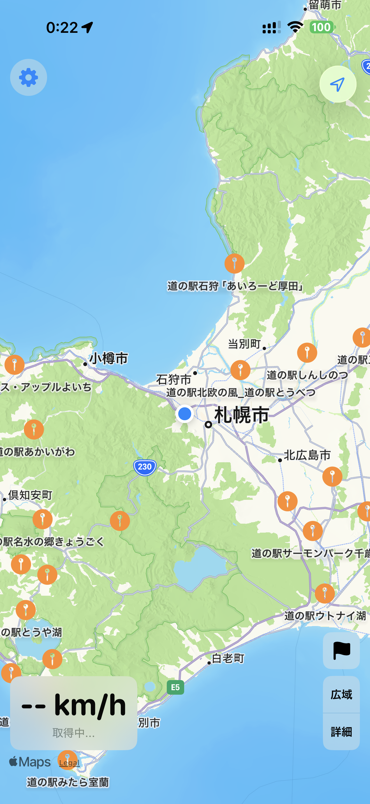
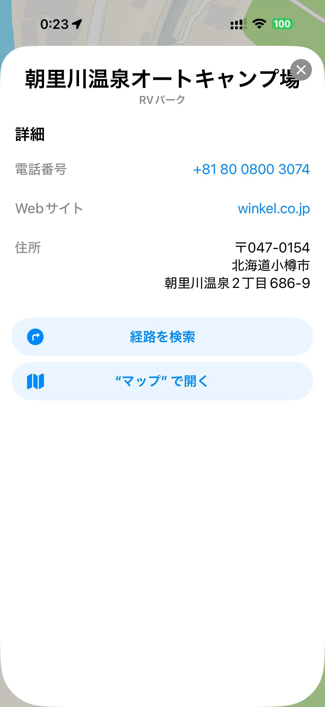

# Michi-navi（道ナビ）

**走行中の iPhone をもっとスマートに。Apple CarPlay 対応ドライビングタスクアプリ。**

[](LICENSE)
[](https://developer.apple.com/ios/)
[](https://developer.apple.com/carplay/)

---

## 概要

Michi-navi は、走行中に最小限の操作でドライブ補助情報を提供する CarPlay 対応 iPhone アプリです。

### 主な機能

- **地図表示** — 現在地・速度・方位のリアルタイム表示（MapKit）
- **道の駅マッピング** — 全国約 1,200 箇所の道の駅をビューポート連動で地図上に表示
- **道の駅詳細** — 写真・施設設備アイコン・公式サイトリンク付き詳細シート
- **施設表示（POI）** — ガソリンスタンド / コンビニ / レストラン / 駐車場 / RVパーク・キャンプ場の表示切替
- **目的地ナビ** — 道の駅またはRVパークを検索し、Apple Maps でナビ開始
- **設定** — 検索範囲スライダー（50〜400km）、施設表示トグル
- **広域 / 詳細ズーム** — ワンタップで 120km 広域 / 400m 詳細に切替
- **CarPlay 対応** — CarPlay Driving Task テンプレート（POI テンプレート）

## スクリーンショット

| 地図画面 | 道の駅詳細 | RVパーク詳細 |
|---------|-----------|-------------|
|  |  |  |
| 道の駅ピン・POI表示 | 施設設備・写真・ナビ開始 | Apple Maps 提供データ |

> **Note**: スクリーンショットは開発中のものであり、正式リリース版とは異なる場合があります。

## 技術スタック

| レイヤー | 採用技術 |
|---------|---------|
| 言語 | Swift 6.x |
| UI（iPhone） | SwiftUI（iOS 17+） |
| 地図 | MapKit（iOS 17+） |
| 位置情報 | CoreLocation |
| CarPlay | CarPlay Framework（Driving Task） |
| データ | JSON バンドル（道の駅）・MapKit 標準 POI |

## 要件

- **iPhone**: iOS 17.0 以上
- **CarPlay**: 対応車または社外ナビ
- **Xcode**: 16.0 以上（Apple Silicon Mac 推奨）

## セットアップ

```bash
git clone https://github.com/osprey74/michi-navi.git
cd michi-navi
open MichiNavi.xcodeproj
```

### CarPlay Simulator のセットアップ

1. Xcode → Xcode メニュー → Open Developer Tool → Additional Tools for Xcode
2. CarPlay Simulator をインストール
3. Xcode Simulator でアプリを起動後、CarPlay Simulator を起動して接続

### エンタイトルメント申請

CarPlay Driving Task エンタイトルメントは Apple への申請が必要です。

1. [Apple Developer Program](https://developer.apple.com/programs/) に加入
2. [CarPlay 開発者ページ](https://developer.apple.com/carplay/) からエンタイトルメントを申請
3. 承認後、Xcode の Signing & Capabilities に追加

## プロジェクト構成

```
MichiNavi/
├── App/                        エントリポイント・AppDelegate
├── Features/
│   ├── Map/                    地図画面（ContentView）
│   ├── Settings/               設定画面
│   ├── Destination/            目的地選択（道の駅 / RVパーク）
│   └── StationDetail/          道の駅詳細画面
├── CarPlay/                    CarPlay テンプレート
├── Shared/
│   ├── Models/                 データモデル（RoadsideStation, DriveState, AppSettings）
│   └── Services/               ビジネスロジック（Location, Navigation, RoadsideStation）
└── Resources/                  道の駅 JSON データ
```

## 開発ロードマップ

| Phase | 内容 | 状態 |
|-------|------|------|
| Phase 0 | Xcode プロジェクト作成・CarPlay 動作確認 | ✅ 完了 |
| Phase 1 | 地図・位置情報・速度表示 | ✅ 完了 |
| Phase 2 | 道の駅データ・マッピング・詳細画面 | ✅ 完了 |
| Phase 3 | 設定画面・POI 表示・検索範囲 | ✅ 完了 |
| Phase 4 | RVパーク対応・ビューポート連動・ズームプリセット | ✅ 完了 |
| Phase 5 | CarPlay テンプレート（POI テンプレート） | ✅ 完了 |
| Phase 6 | RVパーク自前データ対応（JRVA 問合せ中） | 🔲 検討中 |
| Phase 7 | WeatherKit・Live Activity・Widget | 🔲 |
| Phase 8 | App Store 審査・公開 | 🔲 |

## データソース

| データ | ソース | ライセンス |
|--------|--------|-----------|
| 道の駅（約 1,200 件） | 国土交通省 公開データ | 政府標準利用規約 |
| 施設 POI（GS / コンビニ等） | MapKit 標準 POI | Apple MapKit 利用規約 |
| RVパーク・キャンプ場 | MapKit 標準 POI（暫定） | Apple MapKit 利用規約 |

> **Note**: RVパークの自前データ（JRVA 認定 RVパーク約 608 件）については、日本RV協会にデータ利用を問合せ中です。

## ライセンス

MIT License — © 2026 osprey74
