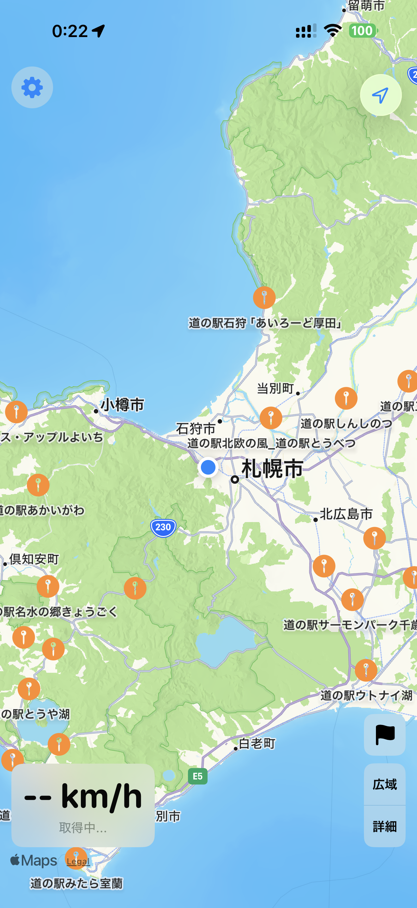

# Michi-navi（道ナビ）

**北海道の道の駅・カントリーサインを巡る iPhone ドライビングコンパニオン。**

[](LICENSE)
[](https://developer.apple.com/ios/)

---

## 概要

Michi-navi は、北海道をドライブしながら道の駅・カントリーサインを楽しむための iPhone アプリです。

### 主な機能

- **地図表示** — 現在地・速度・方位のリアルタイム表示（MapKit）
- **道の駅一覧** — 周辺の道の駅を距離順に表示
- **道の駅詳細** — 施設設備・公式サイトリンク・フォトアルバム（最大 3 枚）
- **お気に入り・訪問済み管理** — 行きたい場所・行った場所を記録
- **外部ナビ連携** — Apple Maps / Google Maps / Yahoo!カーナビ / Waze に誘導

## スクリーンショット

| 地図画面 | 道の駅詳細 |
|---------|-----------|
|  |  |
| 道の駅ピン・周辺検索 | 施設設備・写真・ナビ開始 |

> **Note**: スクリーンショットは開発中のものであり、正式リリース版とは異なる場合があります。

## 技術スタック

| レイヤー | 採用技術 |
|---------|---------|
| 言語 | Swift 6.x |
| UI | SwiftUI（iOS 17+） |
| 地図 | MapKit（iOS 17+） |
| 位置情報 | CoreLocation |
| データ | JSON バンドル（道の駅） |

## 要件

- **iPhone**: iOS 17.0 以上
- **Xcode**: 16.0 以上（Apple Silicon Mac 推奨）

## セットアップ

```bash
git clone https://github.com/osprey74/michi-navi.git
cd michi-navi
open MichiNavi.xcodeproj
```

## プロジェクト構成

```
MichiNavi/
├── App/                        エントリポイント・AppDelegate
├── Features/
│   ├── Map/                    地図画面（ContentView）
│   ├── Settings/               設定画面・クレジット
│   ├── Destination/            目的地選択
│   ├── StationDetail/          道の駅詳細・フォトアルバム
│   └── StationList/            道の駅リスト
├── Shared/
│   ├── Models/                 データモデル（RoadsideStation, DriveState, AppSettings）
│   └── Services/               ビジネスロジック（Location, Navigation, RoadsideStation, Photo）
└── Resources/                  道の駅・カントリーサイン JSON データ
```

## データ出典

- **道の駅データ**: 一般社団法人 全国道の駅連絡会（利用許諾済み）http://www.michi-no-eki.jp/

## 開発ロードマップ

| Phase | 内容 | 状態 |
|-------|------|------|
| Phase 1 | 地図・位置情報・速度表示 | ✅ 完了 |
| Phase 2 | 道の駅データ・一覧・詳細画面 | ✅ 完了 |
| Phase 3 | 設定・お気に入り・訪問済み | ✅ 完了 |
| Phase 4 | フォトアルバム・外部ナビ連携 | ✅ 完了 |
| Phase 5 | App Store 審査・公開 | 🔲 |

## Support / 開発を応援する

Michi-Navi を気に入っていただけたら、開発の継続を応援してください ☕

[](https://github.com/sponsors/osprey74)
[](https://ko-fi.com/osprey74)

## ライセンス

MIT License — © 2026 osprey74
