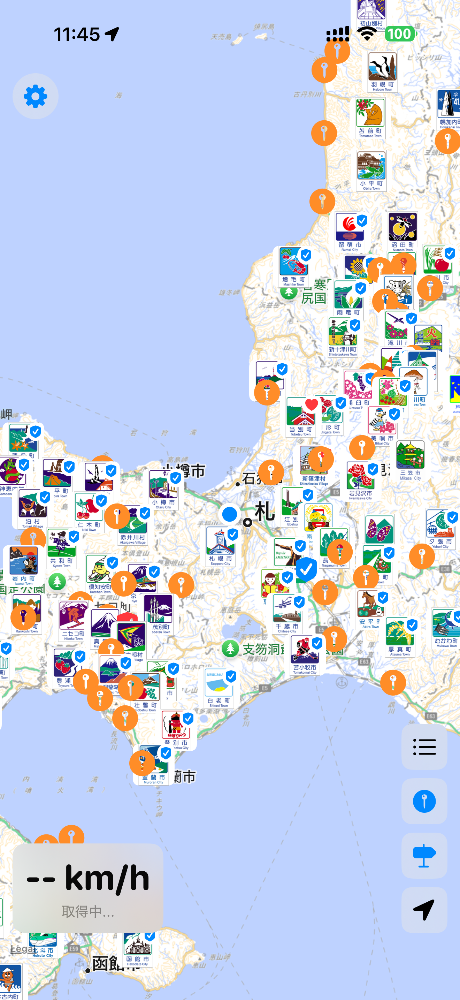
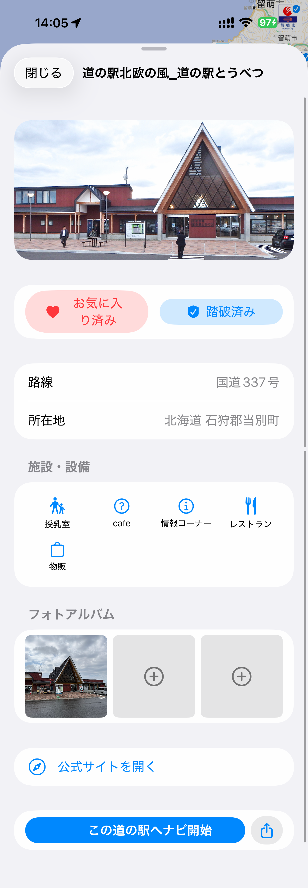
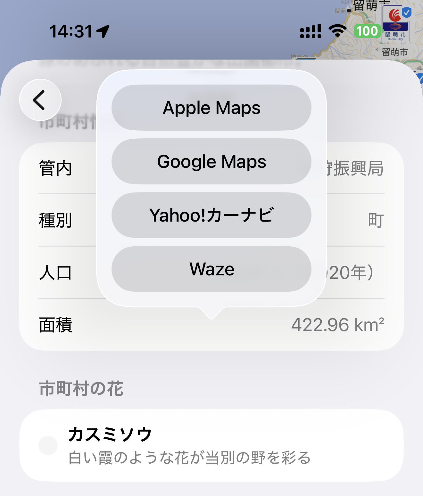
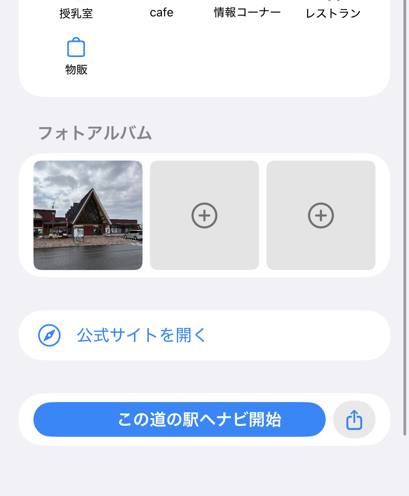
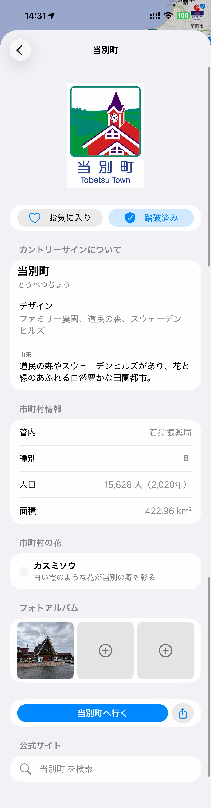
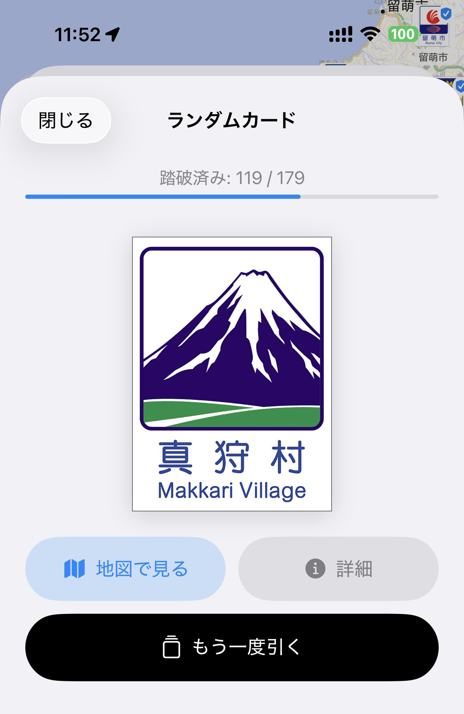
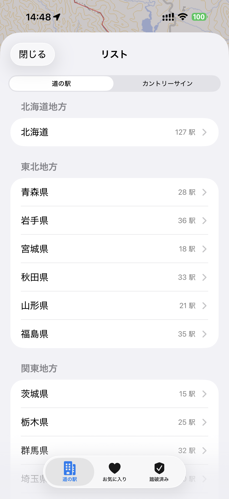
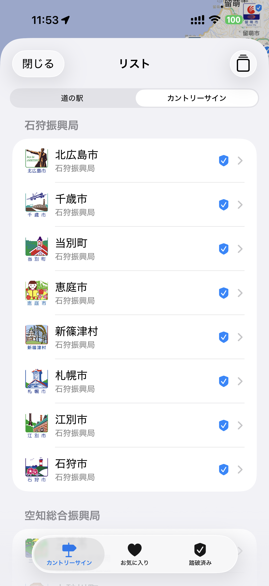
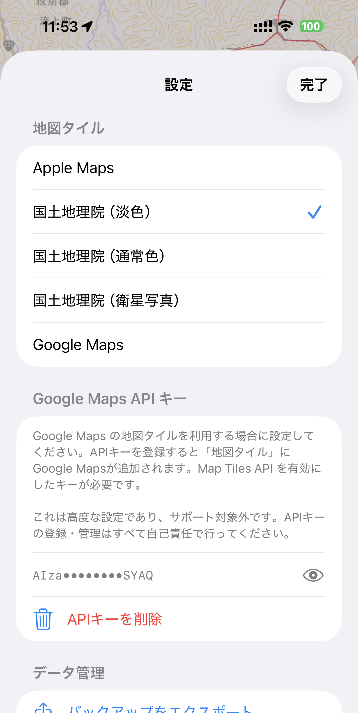

# Michi-navi User Guide (iOS)

Michi-navi (道ナビ) is a driving companion app for exploring Hokkaido's roadside stations (michi-no-eki) and country signs. It provides nearby roadside station lists, facility details, photo albums, country sign information, and more.

**Supported version: Michi-navi v1.0 (iOS 17+)**

## Table of Contents

- [Getting Started](#getting-started)
- [Map Screen Layout](#map-screen-layout)
- [Finding Roadside Stations](#finding-roadside-stations)
- [Roadside Station Details](#roadside-station-details)
- [Country Signs](#country-signs)
- [Random Card Draw](#random-card-draw)
- [Favorites & Visited Tracking](#favorites--visited-tracking)
- [List Screen](#list-screen)
- [Settings](#settings)
- [FAQ](#faq)

---

## Getting Started

### Required Permissions

On first launch, the app requests the following permissions:

| Permission | Purpose | Recommended |
|------------|---------|-------------|
| **Location** | Current position, speed, and heading | **Always Allow** |
| **Photo Library** | Photo albums for stations and country signs | Allow while using |

> **Note:** Setting location permission to "Always Allow" enables the app to continue tracking your position in the background, allowing seamless resumption after sleep or switching apps while driving.

### Recommended Equipment

- iPhone (iOS 17 or later)
- Vehicle mount or stand
- Charging cable (GPS and continuous background location tracking consume significant battery)

---

## Map Screen Layout

The map screen is displayed when you launch the app.

### UI Elements

| Position | Element | Description |
|----------|---------|-------------|
| Top-left | **Settings button (⚙)** | Opens [Settings](#settings) |
| Bottom-left | **Speed panel** | Displays current speed (km/h) and weather info |
| Bottom-right (vertical) | **4 control buttons** | See below |

### Control Buttons

| Icon | Function |
|------|----------|
| ☰ List | Opens the [List screen](#list-screen) |
| 📍 Station markers | Toggles roadside station markers on/off |
| 🚩 Country sign markers | Toggles country sign markers on/off |
| 📍 Current location | Centers the map on your current location |

### Speed-Based Auto-Zoom

While driving, the map zoom level automatically adjusts based on your speed.

| Speed | Approximate view range |
|-------|------------------------|
| Stopped (<5 km/h) | ~120 km |
| Urban (5–30 km/h) | ~18 km |
| Suburban (30–60 km/h) | ~36 km |
| Highway (60–100 km/h) | ~60 km |
| Expressway (>100 km/h) | ~84 km |

> **Note:** Manual zoom or tapping the current location button **pauses auto-zoom for 30 seconds**. Manual control takes priority during this time.

### Marker Colors

| Color | Meaning |
|-------|---------|
| Blue | Regular roadside station |
| Red (heart) | Favorited station |
| Purple (check) | Visited station |

---

## Finding Roadside Stations

### Nearby Stations

The app automatically searches for roadside stations **within 120 km** of your current location and displays them as markers on the map.

- Driving (above 5 km/h): Prioritizes stations in your **direction of travel (±45° cone)**
- Stopped: Shows stations in all directions
- Up to 10 stations, sorted by distance

### Tap a Station Marker

Tapping a station marker on the map opens the [Station Details](#roadside-station-details) sheet.

### Browse from the List

Open the [List screen](#list-screen) via the ☰ button at the bottom-right of the map, and filter by region, prefecture, or municipality.

---

## Roadside Station Details

Tapping a station marker or selecting a station from the list opens the details sheet.

### Information Displayed

- **Photo** — Representative image of the station
- **Favorite button (♡)** — Heart icon to bookmark
- **Visited button (✓)** — Shield checkmark to mark as visited
- **Basic info** — Distance (km/m), cardinal direction, road name, location (prefecture/municipality)
- **Facility icons** — Shows available amenities using 18 distinct icons
- **Photo album** — Save up to 3 photos per station
- **External navigation** — Launch navigation in one of 4 apps

### Facility Icons

| Icon | Facility | Icon | Facility |
|------|----------|------|----------|
| 🏧 | ATM | 🍴 | Restaurant |
| ♨ | Hot spring (onsen) | ⚡ | EV charger |
| 📶 | Wi-Fi | 🍼 | Baby room |
| ♿ | Accessible toilet | ℹ | Information |
| 🛍 | Shop | 🎨 | Experience/workshop |
| 🏛 | Museum | 🌳 | Park |
| 🏨 | Hotel | 🚐 | RV park |
| 🐕 | Dog run | 🚲 | Bicycle rental |
| ⛺ | Campground | 👣 | Footbath |

### External Navigation Apps

From the navigation buttons at the bottom of the details sheet, you can launch route guidance in the following apps:

| App | Notes |
|-----|-------|
| Apple Maps | Pre-installed on iOS |
| Google Maps | Requires separate installation |
| Yahoo! Car Navi | Requires separate installation |
| Waze | Requires separate installation |

> **Note:** Uninstalled apps are automatically hidden from the menu.

### Share Location

Use the share button at the bottom of the sheet to send the station's location to other apps via the iOS share sheet.

### Photo Album

You can save up to 3 photos per station.

1. **Add a photo:** Tap an empty slot (+ icon) → select from Photo Library
2. **View photos:** Tap a thumbnail → fullscreen view (swipe to navigate)
3. **Delete a photo:** Long-press a thumbnail → confirm deletion

> **Important:** Photos are stored locally on your device (no iCloud sync). Uninstalling the app will delete your photos.

---

## Country Signs

**Country signs (カントリーサイン)** are decorative signs installed at municipal boundaries that showcase each region's unique character. Michi-navi includes all **179 Hokkaido municipalities'** country signs.

### Enabling Country Sign Markers

Toggle the 🚩 button at the bottom-right of the map to show/hide country sign markers. When enabled, municipality boundaries are also displayed.

### Tap a Country Sign Marker

Tapping a marker opens the country sign details sheet.

### Information Displayed

- **Country sign image** — Actual sign design
- **Favorite (♡) / Visited (✓) buttons** — Same as roadside stations
- **Sign info** — Name (kanji/kana), design motif, origin story
- **Municipality info** — Subprefecture, type (city/town/village), population, area
- **Town flower** — Flower name, description, color info
- **Tourism link** — Link to the municipality's tourism website
- **Navigation** — Navigate to the sign's location or town hall

---

## Random Card Draw

A gacha-style feature that randomly draws one unvisited country sign. Like the dice journey from the popular Japanese show "Suiyōbi no Downtown," you can leave the next destination to chance.

### How to Use

1. Tap the **🃏 "Draw a card"** button in the Country Signs tab of the List screen.
2. With animation, a random unvisited country sign appears.
3. From the card, you can:
   - **Draw another** — Randomly display a different sign
   - **View on map** — Return to the map showing the sign's location
   - **View details** — Open the country sign details sheet

### All Municipalities Complete

When you've visited all 179 municipalities, **"All 179 municipalities conquered!"** is displayed.

---

## Favorites & Visited Tracking

Roadside stations and country signs are tracked independently.

### Favorites (♡)

**Purpose:** Bookmark places you want to visit or find interesting.

- Tap the heart icon in the station or country sign details sheet
- The marker on the map turns **red**
- View them in the "Favorites" tab of the List screen

### Visited (✓)

**Purpose:** Stamp rally style record of places you've actually been to.

- Tap the shield check icon in the details sheet
- The marker on the map turns **purple**
- View them in the "Visited" tab of the List screen

> **Important:** Roadside station favorites/visited and country sign favorites/visited are **tracked separately**.

---

## List Screen

Open the list screen via the ☰ button at the bottom-right of the map.

### Tab Switching

The segmented picker at the top switches between **Roadside Stations** and **Country Signs**. The Country Signs tab is only available when country sign markers are enabled.

### Roadside Stations Tab

| Subtab | Content |
|--------|---------|
| **All Stations** | 4-level filter: Region → Prefecture → Municipality → Station |
| **Favorites** | Stations with hearts |
| **Visited** | Visited stations |

### Country Signs Tab

| Subtab | Content |
|--------|---------|
| **All Signs** | Filter by subprefecture (14 regional divisions) |
| **Favorites** | Favorited country signs |
| **Visited** | Visited country signs |
| **🃏 Draw a card** | [Random Card Draw](#random-card-draw) feature |

---

## Settings

Open settings via the ⚙ button at the top-left of the map screen.

### Map Tile Selection

| Tile | Description |
|------|-------------|
| **Apple Maps** | Standard iOS maps (default, fastest) |
| **GSI Pale** | Japan Geospatial Information Authority pale map (clear colors) |
| **GSI Standard** | GSI standard map |
| **GSI Satellite** | GSI aerial photography |
| **Google Maps** | Google Maps (requires API key) |

### Google Maps API Key Setup

To use Google Maps tiles, you must **obtain a Google Cloud API key yourself**.

1. Create a project in [Google Cloud Console](https://console.cloud.google.com/).
2. Enable the **Map Tiles API**.
3. Issue an API key.
4. In Michi-navi Settings, paste the key into the **Google Maps API Key** field.
5. The eye icon toggles key visibility.
6. The delete button removes the key (Michi-navi automatically reverts to GSI Pale).

> **Caution:** Google Maps API usage may incur charges. Please review Google Cloud pricing. Use at your own risk.

---

## FAQ

### Q. The speed display doesn't match my actual speed.

The app displays instantaneous GPS-based speed, so there may be discrepancies in tunnels or areas with poor reception. Since speed is calculated from time differences between location updates, it may briefly fluctuate during rapid acceleration.

### Q. Are photos stored in the cloud?

**No.** Photos are saved locally in the Michi-navi app sandbox. Uninstalling the app or resetting the device will delete your photos.

### Q. Roadside station markers don't appear.

Check the following:

1. Is the 📍 station markers button at the bottom-right enabled?
2. Is location permission set to "Always Allow"?
3. Are there roadside stations within 120 km? (Markers don't appear in areas without roadside stations.)

### Q. Battery drains quickly.

GPS and background location tracking while driving consume significant battery. A vehicle charging cable is recommended.

### Q. Are there country signs in other prefectures?

Country signs exist at municipal boundaries nationwide, but Michi-navi currently only includes **Hokkaido's 179 municipalities**.

### Q. The same sign keeps appearing in the random card draw.

Signs marked as visited are excluded from the draw. After actually visiting a sign, don't forget to mark it as visited.
